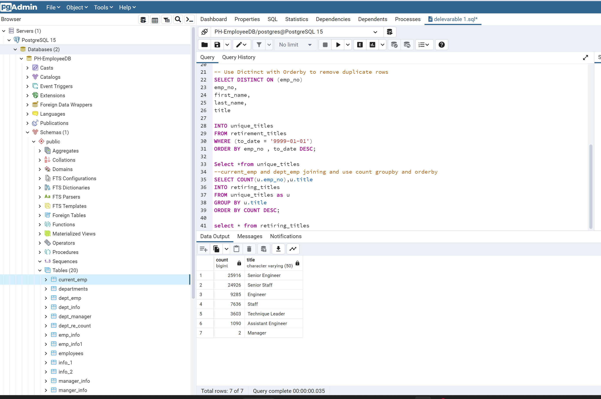

# Pewlett-Hackard-Analysis
# Overview Of the Projcet

### Database keys
  **Database Keys** identify records from tables and establish relationships between tables. There are many types of keys. We used 2 type of keys here,**PRIMARY KEYS and FOREIGN KEYS**
    
### Primary keys
   **Primary Keys** are most essential keys for database and tables.It is an Unique Identity of each table and Database.When table are created primary keys are must to add primary keys created the link between the table or as I said estblished a relationship between two tables.
### Foreign Keys
   **Foreign keys** are the primary keys of another tables which saved as Forign keys in the other tables.so, basically as Primary keys are unique identification for the table like that foreign keys are unique identifications of the other tables. It is as important as Primary keys.
### Entity Relationship Diagram(ERD)
   **Entity Relationship Diagram (ERD)** is the most important part of SQL. It is the flowchart of the Database which contain Primary keys,Foreign Keys and Datatypes of the columns.ERD also shows the flow of the tables.
   
   
# Deliverable 1: The Number of Retiring Employees by Title
   1. In this task we have to display the Number of Retiring Employees by title with the used of joing tables query.
   First We have to retrive **emp_no,first_name and last_name** from the table **Employees** and **title,from_date and to_date** from the **Titles** table, after retrivig that columns from the tables we create the another table to save the output called **retirement_titles** table. To getting retirement_titles table data we have to join or merge the Employees table and Titles table and then we have to performing filterretion on the birth_date column for getting the data in retirement_titles.csv file.
   
   After getting the desired data we saved that data as the csv file.
   
   
   
   2. After exporting this .CSV file we have to drop duplicates from that table and csv for that we used **Distinct On()** 
   
   
   3. After performing that we have to retrieve the number of employees by their most recent job title who are about to retire and put that numbers into **Descending** order.
   
   
# Deliverable 2: The Employees Eligible for the Mentorship Program
# Over View Of Analysis
 1. In this task we have to retriving the Employees who able to join the Mentorship Program  for that first we have to retrieve the **emp_no, first_name, last_name, and birth_date** columns from the **Employees** table, then we have to retrieve the **from_date and to_date** columns from the **Department Employee(dept_emp)** table.
and also retrieve the **title** column from the **Titles** table.
2. We use a **DISTINCT ON** statement to retrieve the first occurrence of the employee number for each set of rows defined by the ON () clause, we save this data in to the **mentorship_eligibilty** table .
3. Join the 3 tables **employees,dept_emp and titles** with the use of Primary keys and use the filter on dept_emp's **to_date** column to retrive the desired data from the query and save that into the **mentorship_eligibilty.csv**.

# Deliverable 3: A written report on the employee database analysis
## Over View Of Analysis
* Explain the purpose of this analysis
1. In this deliverable, we have to determine the number of retiring employees per title, and identify employees who are eligible to participate in a mentorship program.And in the deliverable 3 we have to help Bobby's manager with writing the report prepare for the upcoming "silver tsunami."

## Result
 * From the finding of the eligible retirees, High Percentage of the workforce could retire.
 * From the job titles of the eligible retirees, as below.
 * 25916,Senior Engineer
 * 24926,Senior Staff
 * 9285,Engineer
 * 7636,Staff
 * 3603,Technique Leader
 * 1090,Assistant Engineer
 * 2,Manager

## Summary
Provide high-level responses to the following questions, then provide two additional queries or tables that may provide more insight into the upcoming "silver tsunami.":

1) How many roles will need to be filled as the "silver tsunami" begins to make an impact?.

 72,458 roles are in urgent need to be filled out as soon as the workforce starts retiring at any given time.

2) Are there enough qualified, retirement-ready employees in the departments to mentor the next generation of Pewlett Hackard employees?

 No, we have 1,549 employees who are eligible to participate in a mentorship program.
 

